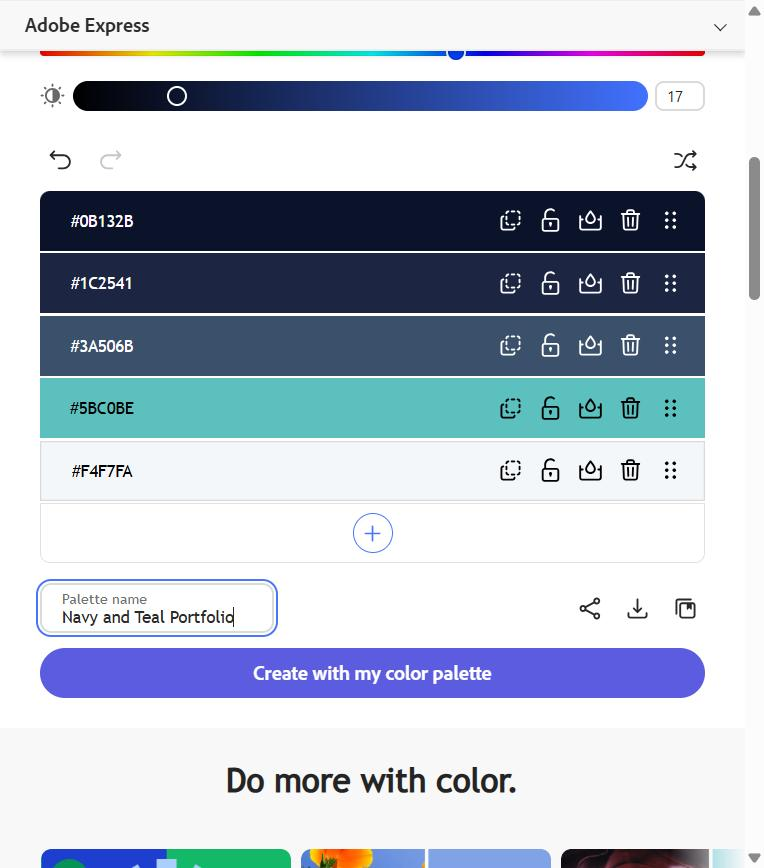

# Personal Portfolio - INFR3120 Assignment 1

**Author:** Amin Al-Wagih
**Live site (GitHub Pages):** https://aminalwagih.github.io/portfolio/
**Repository:** https://github.com/AminAlWagih/portfolio

A four page portfolio built with HTML5 and CSS3: Home, About Me, Projects, and Contact Me. It is a multi-page site (four separate HTML files), not a single page application.

## Project structure

```
index.html        Home page with navigation and hero banner
about.html        Photo, introduction, and embedded video
projects.html     Five projects with headings and descriptions
contact.html      Contact form with validation
css/style.css     Shared styles and colour variables
css/mobile.css    Phone layout
css/tablet.css    Tablet layout
css/laptop.css    Laptop and desktop layout
js/contact.js     Form validation messages
images/           Profile photo and video poster
media/            Introduction video (intro.mp4)
```

## Responsive design (fluid layout and media queries)

The layout uses percentage widths, fluid images, and floats. **Flexbox is not used anywhere.** Each viewport has its own CSS file, linked with a `media` attribute in every HTML page.

| File | Media query | Why this range |
|------|-------------|----------------|
| `mobile.css` | `max-width: 767px` | Covers phones in portrait (about 320px to 430px) and small landscape phones. One column with stacked, full-width navigation links that are easy to tap. |
| `tablet.css` | `min-width: 768px` and `max-width: 1023px` | 768px is the width of a standard portrait tablet. Two columns of cards (48% each with a 4% gap), and the photo sits beside the text. |
| `laptop.css` | `min-width: 1024px` | 1024px is the width of a small laptop and a landscape tablet. Three columns of cards (31% each with 3.5% gaps), and the logo and navigation sit on one line using floats. |

`style.css` holds everything shared (colours, typography, header, footer, form), and is written so that the page already works as one fluid column before any viewport file is applied.

## Gradients

- **Linear gradient (to right):** the site header on all four pages (`.site-header` in `css/style.css`), from Deep Navy to Steel Blue.
- **Angled linear gradient (135deg):** the hero banner on the Home page (`.hero` in `css/style.css`), from Midnight through Steel Blue to Teal.
- **Angled linear gradient (45deg):** the footer on all four pages (`.site-footer` in `css/style.css`).

## Colour scheme

I built the palette in Adobe Color's palette generator (https://color.adobe.com/create) by entering my five chosen colours, and named it **Navy and Teal Portfolio**. The palette was not saved to an Adobe account library, so the screenshot below is the record of it.



| Role | Name | Hex |
|------|------|-----|
| Text, dark backgrounds | Deep Navy | `#0B132B` |
| Headings, gradient | Midnight | `#1C2541` |
| Links, borders, gradient | Steel Blue | `#3A506B` |
| Accent, buttons, card borders | Teal | `#5BC0BE` |
| Page background | Mist | `#F4F7FA` |

These colours are defined once as CSS variables at the top of `css/style.css` and used on every page. The dark navy tones keep text readable on light backgrounds, and teal is used sparingly for emphasis. Text and background pairings were chosen for strong contrast to pass WAVE.

## Form validation

The contact form uses HTML5 validation (`required`, `type="email"`, `type="tel"`, `pattern`, `minlength`) plus `js/contact.js` to show clear messages.
- **Name:** required, letters, spaces, hyphens, apostrophes
- **Email:** required, valid email format
- **Cell No.:** required, 10 digits (for example 905-555-1234)
- **Comments:** required, 10 to 500 characters

GitHub Pages has no server, so after valid input the form shows a thank-you message and does not send the data anywhere.

## Testing and validation

All checks were run on the live GitHub Pages site on October 9, 2026.

| Check | Tool | Result |
|-------|------|--------|
| HTML | W3C Markup Validator, Nu Html Checker (https://validator.w3.org/nu/) | All four pages (`index`, `about`, `projects`, `contact`): no errors or warnings |
| CSS | W3C CSS Validator, CSS level 3 + SVG (https://jigsaw.w3.org/css-validator/) | All four files (`style`, `mobile`, `tablet`, `laptop`): 0 errors, 0 warnings. A first run showed one warning in `mobile.css` because it used a CSS variable defined in another file; I replaced it with the hex colour, and it now passes |
| Links | W3C Link Checker, recursive (https://validator.w3.org/checklink) | 9 documents checked, no broken links. The only items listed are the `mailto:` email links, which the tool does not check |
| Spelling | LanguageTool, English (Canada) (https://languagetool.org) | No misspellings. It only flagged proper nouns and acronyms that are correct (Al-Wagih, ERPsim, BUSI, LANs, WANs). I accepted its one comma suggestion on the Contact page |
| Accessibility | WAVE (https://wave.webaim.org/) | All four pages: 0 errors, 0 contrast errors, AIM score 10 out of 10. The About page shows 2 alerts, which are WAVE's standard reminder to provide captions or a transcript for an HTML5 video |

## Sources and citations

All code was written for this assignment using concepts from the course lectures. External code used:

- None. (If you copy anything, list the source, author, and what it is used for here. External code must be 10% or less of the project.)
